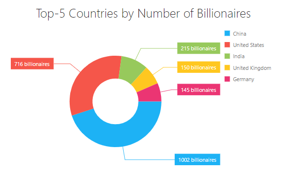

<!-- default badges list -->

<!-- default badges end -->
# DevExtreme PieChart - Getting Started 

This repository stores the code examples of the PieChart component for the [Getting Started with PieChart](https://js.devexpress.com/Documentation/Guide/UI_Components/PieChart/Getting_Started_with_PieChart/) tutorial. The PieChart UI component visualizes data as a circle divided into portions (slices) to illustrate data proportions. This tutorial shows how to add a PieChart to the page and configure the component's core features.

## Files to Review

- **Angular**
    - [app.component.html](Angular/src/app/app.component.html)
    - [app.component.ts](Angular/src/app/app.component.ts)
- **jQuery**
    - [index.js](jQuery/src/index.js)
- **React**
    - [App.js](React/src/App.js)
- **Vue**
    - [App.vue](Vue/src/App.vue)

## Documentation

- [Getting Started with PieChart](https://js.devexpress.com/Documentation/Guide/UI_Components/PieChart/Getting_Started_with_PieChart/)

- [PieChart - API Reference](https://js.devexpress.com/Documentation/ApiReference/UI_Components/dxPieChart/)
<!-- feedback -->
## Does this example address your development requirements/objectives?

 

(you will be redirected to DevExpress.com to submit your response)
<!-- feedback end -->
